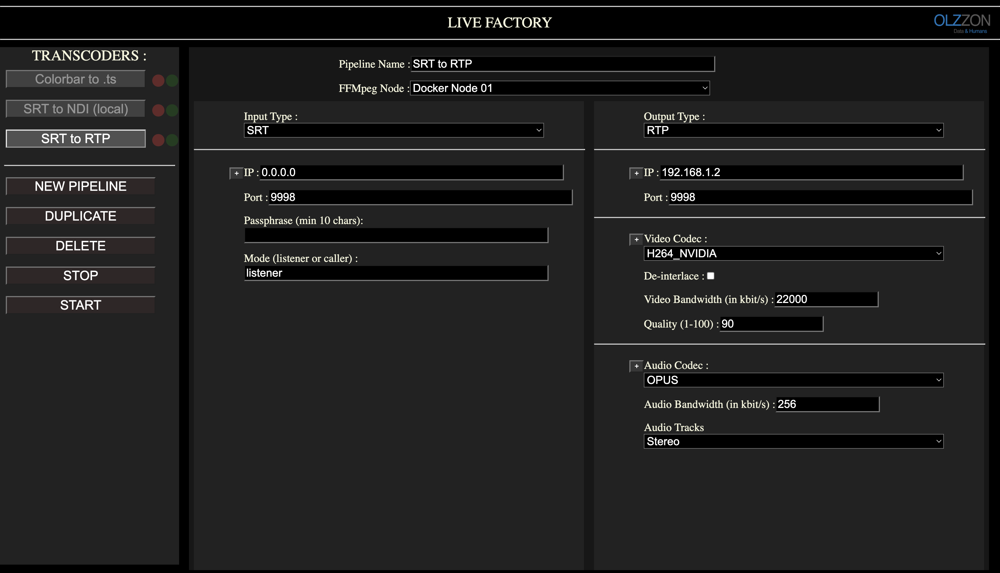

# Live-factory
GUI based Reciever - transmitter - transcoder for video and audio 

Livefactory is build with containerbased production in mind.
So instead of including ffmpeg inside the code, ffmeg runs an instance pr. Transcoder.
You can run a local ffmpeg instance or use the docker API for controlling other machines (nodes  https://docs.docker.com/engine/api/v1.43/) 
It's using the dockerode package for handling this (https://www.npmjs.com/package/dockerode)




Roadmap:
+ Local ffmpeg support with most used protocols
* Support for docker based ffmpeg (in progress)
* Support for controlling multiple ffmpeg nodes (in progress) 
* REST API for external control
* 2110 Decklink IP card support 
* NMOS support
* GUI refining
* A dockerbased ffmpeg engine with NDI and RIST support (in progress, but due to licence issues this might not be open sources)

## Status of protocol support:
Following input/output is supported

### Input:
SRT, File, NDI, Decklink (SDI), Mpeg-ts, Colorbar, UDP, TCP, RTP

### Output:
SRT, NDI, Decklink (SDI), Mpeg-ts, Screen, TCP, RTP

### Codecs:
COPY is the settings when output to NDI, Decklink, Screen etc.

For transport of h264/265 following options is available:
H264_NATIVE , HEVC_NATIVE, H264_MAC, HEVC_MAC, H264_NVIDIA, HEVC_NVIDIA

### Custom:
In input and/or output a custom option is available, this is for adding custom ffmpeg commands.

## Running live-factory:
Install git, node and yarn on your machine.
```
git clone https://github.com/olzzon/live-factory
cd live-factory
yarn
yarn build
yarn start
``` 

Open GUI in browser:
```
http://localhost:1406
```

### Settings:
When running Live-factory for the first time, a settings.json file will be created, with all the available options.
Depening on the setup, it's possible to remove certain types from the allowed lists.
An example of the settings.json file is placed in: Doc/settings.json

Here's the basic structure of the settings.json file:
```
{
    "maxActiveEncoders": 1,
    "nodeList": [
        {
            "name": "FFmpeg local",
            "type": "FFMPEG",
            "url": "/usr/bin/ffmpeg"
        },
        {
            "name": "Docker FFmpeg local",
        .........................
    ],
    "allowedInputTypes": [
        {
            "value": "COLORBAR",
            "label": "COLORBAR"
        },
        {
            "value": "SRT",
            "label": "SRT"
        },
        ..........................
    ],
    "allowedOutputTypes": [
        {
            "value": "NDI",
            "label": "NDI"
        },
        {
            "value": "SRT",
            "label": "SRT"
        },
        ................................
    ],
    "allowedOutputEncoderTypes": [
        {
            "value": "COPY",
            "label": "COPY"
        },
        {
            "value": "H264_NATIVE",
            "label": "H264_NATIVE"
        },
        ..................................
    ]
}
```


# Setting up ffmpeg on your machine: 

### FFMPEG merging from master:

```
git remote add local /Users/olzzon/coding/ffmpeg_org  
git checkout -b latest-master  
git push
git push --set-upstream origin latest-master 
git fetch local   
git merge local/master
git commit -a

```

### MAC M1 Installation:
Install BREW:
```
/bin/bash -c "$(curl -fsSL https://raw.githubusercontent.com/Homebrew/install/HEAD/install.sh)"

export PATH=$PATH:/opt/homebrew/bin
cd ~/
touch .zshrc
echo export PATH=$PATH:/opt/homebrew/bin >> .zshrc
```

Install dependencies:
```
brew install automake fdk-aac git lame libass libtool libvorbis libvpx opus sdl shtool texi2html theora wget x264 x265 xvid nasm librist
```
For getting other ffmpeg dependencies:
```
brew install ffmpeg openssl
```

Install NDIRedistV5Apple:

```
install: http://new.tk/NDIRedistV5Apple
```

Copy lib files to:
```
cp lib* /usr/local/lib 
```

### Ubuntu 20.04 installation:
Upload files
(live-factory and ffmpeg+lib.tar.gz)
via SSH:
```
scp /Users/olzzon/Downloads/live-factory livefactory@192.168.1.75:/home/livefactory/live-factory

scp /Users/olzzon/coding/ffmpegfiles.zip livefactory@192.168.1.75:/home/livefactory/ffmpeg.zip

```

uncompress the .zip file:
```
sudo apt install unzip
unzip ffmpeg.zip
```
Add dynamic libs to lib folder: 
```
cd ndi-encoder-files
tar -zxvf lib.tar.gz
mv lib/libsrt* /usr/lib/
mv lib/libndi* /usr/lib/
```

install ffmpeg denpencies:
```
sudo apt update -qq && sudo apt -y install autoconf automake build-essential cmake git libssl-dev libfreetype6-dev libgnutls28-dev libmp3lame-dev  libtool libva-dev libvdpau-dev libvorbis-dev libxcb1-dev libxcb-shm0-dev libxcb-xfixes0-dev meson ninja-build pkg-config texinfo wget yasm zlib1g-dev libunistring-dev libaom-dev nasm libx264-dev libx265-dev libnuma-dev libvpx-dev libfdk-aac-dev libopus-dev nvidia-cuda-toolkit libsdl2-dev libass-dev
```

If running on unbuntu server, you need to install Avahi support:
```
sudo apt install avahi-daemon avahi-discover avahi-utils libnss-mdns mdns-scan
```

#### Running on a VM:
set the cpu type for the vm to host

 
#### Set lib path
Set default PATH:
```
nano ~/.bashrc
ADD:
export LD_LIBRARY_PATH="$LD_LIBRARY_PATH:/usr/local/lib/:/usr/lib/"
```

## Mac M1 FFmpeg compilation:

### NDI Support:
Install SDK files and patch ffmpeg
Here's a link to a patch for NDI:
https://gist.github.com/pabloko/8affc8157a83e201503c326a28d17bf2

### RIST support:
https://code.videolan.org/rist/ffmpeg/-/commit/d2765591220d2bc6230617246c64ac482410fb57

### Install SRT support:
```

git clone --depth 1 https://github.com/Haivision/srt.git ~/ffmpeg_sources/srt
cd ~/ffmpeg_sources/srt

brew unlink openssl && brew link openssl --force
echo 'export PATH="/opt/homebrew/opt/openssl@3/bin:$PATH"' >> ~/.zshrc
# For macOS also export OpenSSL paths with the following commands:
# export OPENSSL_ROOT_DIR=$(brew --prefix openssl)
# export OPENSSL_LIB_DIR=$(brew --prefix openssl)"/lib"
# export OPENSSL_INCLUDE_DIR=$(brew --prefix openssl)"/include"

./configure
make
sudo make install

```

### Build FFMPEG
Follow https://trac.ffmpeg.org/wiki/CompilationGuide/macOS

Add dependencies:
```
brew install automake fdk-aac git lame libass libtool libvorbis libvpx opus sdl shtool texi2html theora wget x264 x265 xvid nasm librist
```
```
install: http://new.tk/NDIRedistV5Apple
```

#### Clone FFMPEG-NDI repository:
```
https://github.com/olzzon/ffmpeg-ndi
```


### Make compilation static??? ToDO!!!:
https://video.stackexchange.com/questions/14717/how-to-compile-ffmpeg-with-libfdkaac-into-a-single-static-binary
!Remove all *.dylib in /usr/local/lib

### Configure
```
make distclean 
???? --enable-librist

NO LIBRIST INSTALL ON OTHER MACHINES:
./configure  --prefix="$HOME/coding/ffmpeg/build" --pkg-config-flags="--static" --extra-cflags="-I$HOME/coding/ffmpeg/include --static" --enable-libsrt --enable-shared --enable-static --enable-gpl --extra-version=olzzon --enable-nonfree --enable-libass --enable-libfdk-aac --enable-libfreetype --enable-libvorbis --enable-libvpx --enable-libx264 --enable-libx265 --enable-libopus --samples=fate-suite --enable-videotoolbox --enable-libndi_newtek --enable-decklink --disable-ffplay --disable-doc

```

```
make -j10
sudo make install
```

Rename ffmpeg to ffmpegruntime and copy it to "$HOME/live-factory" folder


# Build FFmpeg Ubuntu x86

## Install TeamViewer AFTER adding dependencies

### Get dependencies:
```
# These two had problems when installed later:
sudo apt install libsdl2-dev libass-dev 

sudo apt update -qq && sudo apt -y install autoconf automake build-essential cmake git libssl-dev libfreetype6-dev libgnutls28-dev libmp3lame-dev  libtool libva-dev libvdpau-dev libvorbis-dev libxcb1-dev libxcb-shm0-dev libxcb-xfixes0-dev meson ninja-build pkg-config texinfo wget yasm zlib1g-dev libunistring-dev libaom-dev nasm libx264-dev libx265-dev libnuma-dev libvpx-dev libfdk-aac-dev libopus-dev nvidia-cuda-toolkit

```

Install NVidia driver:
```
sudo ubuntu-drivers autoinstall
```

### Get source and set path:
```
mkdir ~/bin
cd ~
git clone https://github.com/olzzon/ffmpeg-ndi.git
cd ffmpeg-ndi
PATH="$HOME/bin:$PATH"
PKG_CONFIG_PATH="$HOME/ffmpeg-ndi/lib/pkgconfig" 
```

### Set lib path
Set default PATH:
```
nano ~/.bashrc
ADD:
export LD_LIBRARY_PATH="$LD_LIBRARY_PATH:/usr/local/lib:/usr/lib/"
```

### Install Decklink:
install both Software AND SDK from blackmagicdesign.com
```
copy SDK lib files to ffmpeg-ndi/include
```
### Install NDI SDK:
https://downloads.ndi.tv/SDK/NDI_SDK_Linux/Install_NDI_SDK_v5_Linux.tar.gz
unpack with GUI
copy x86 libndi.so files to ffmpeg-ndi/lib
(HACK: extract SDK and move the libndi.so.5 files to /usr/lib, it's important to move not copy as a cp will creat a new symbolic link for one of the files)

### Compile SRT:
```
cd ~/ffmpeg-ndi
git clone --depth 1 https://github.com/Haivision/srt.git
mkdir srt/build
cd ~/ffmpeg-ndi/srt/build
cmake -DENABLE_C_DEPS=ON -DENABLE_SHARED=ON -DENABLE_STATIC=OFF -fPIC ..
make
sudo make install
```

### Compile CUDA support:
```
cd ~/ffmpeg-ndi
git clone https://git.videolan.org/git/ffmpeg/nv-codec-headers.git
cd nv-codec-headers && sudo make install && cd ..

### Prepare and compile:
```
cd ~/ffmpeg-ndi

./configure --prefix="$HOME/ffmpeg-ndi" --pkg-config-flags="--static" --extra-cflags="-I$HOME/ffmpeg-ndi/include -I/usr/local/cuda/include" --extra-ldflags="-L/usr/local/cuda/lib64 -L$HOME/ffmpeg-ndi/lib" --extra-libs="-lpthread -lm" --ld="g++" --bindir="$HOME/bin" --enable-libsrt --enable-gpl --enable-gnutls --enable-nonfree --enable-libass --enable-libfdk-aac --enable-libfreetype --enable-libvorbis --enable-libvpx --enable-libx264 --enable-libx265 --enable-libopus --samples=fate-suite --enable-libndi_newtek --enable-decklink --enable-nvenc --enable-librist

??? --enable-cuda --enable-cuvid --enable-nvdec --enable-nvenc

make
sudo make install
export LD_LIBRARY_PATH=/usr/local/lib:/usr/lib/:/home/ubuntu/ffmpeg-ndi/lib
source ~/.profile
```

Rebuild remember:
```
make distclean 

### Files for a Linux installation:
Compress lib:
```
tar -czvf lib.tar.gz lib/*
```
Transfer together with ffmpeg


## FFmpeg Examples
Decode HW:
```
./ffmpeg -stream_loop -1 -hwaccel videotoolbox -hwaccel_output_format videotoolbox -re -vsync 0 -i /Users/olzzon/coding/live-factory/media/RedBull.ts -f libndi_newtek -pix_fmt uyvy422 OUTPUT
```
Linux CUDA srt encoder:
```
./ffmpeg -hwaccel cuda -re -stream_loop -1 -i ~/mediefiler/Jazz.mp4 -c:v h264_nvenc -preset llhp -b:v 20M -maxrate:v 30M -bufsize 1M -zerolatency 1 -pix_fmt uyvy422 -f matroska "srt://0.0.0.0:9998?pkt_size=1316&mode=listener"
```

Linux CUDA NDI Source to SRT:
```
/home/ubuntu/live-factory/ffmpegruntime -f libndi_newtek -i "CASPARCG (CCG Ch1)" -c:v hevc_nvenc -preset llhp -b:v 20M -cbr true -zerolatency true -pix_fmt yuv420p -f matroska "srt://0.0.0.0:9001?pkt_size=1316&mode=listener"
```

Linux CUDA NDI Source to UDP:
```
/home/ubuntu/live-factory/ffmpegruntime -f libndi_newtek -i "CASPARCG (CCG Ch1)"  -c:v h264_nvenc -preset llhq -b:v 30000k -cbr true -zerolatency true -pix_fmt yuv420p -c:a libopus -b:a 48k  -pix_fmt uyvy422 -f matroska "udp://0.0.0.0:9001"
```


### Patch NDI - FFMPEG:
https://gist.github.com/pabloko/8affc8157a83e201503c326a28d17bf2

